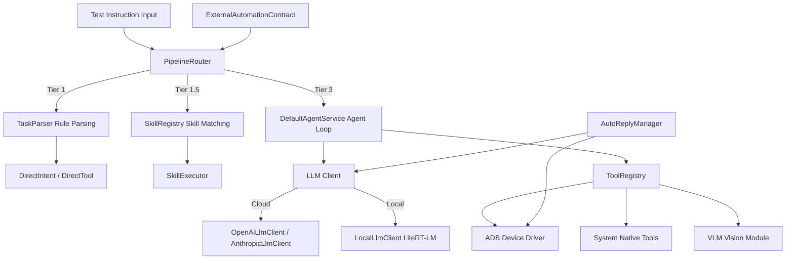

# BQAAgent
BQAAgent is an AI-powered automated test execution engine built for HSBC mobile applications. Driven by Large Language Models (LLMs), it understands natural language test instructions and autonomously operates mobile devices to execute end-to-end business tests on HSBC mobile apps. It supports notification monitoring, multi-step business automation, visual fallback recognition, and works with both cloud-hosted and local on-device LLMs, delivering an all-in-one intelligent testing solution for financial mobile applications.

## Table of Contents
- [Key Features](#key-features)
  - [Core Capabilities](#core-capabilities)
  - [New Enhanced Features](#new-enhanced-features)
- [Architecture Overview](#architecture-overview)
  - [Task Execution Flow](#task-execution-flow)
- [Toolkit List](#toolkit-list)
- [Tech Stack](#tech-stack)
- [Build Guide](#build-guide)
- [Project Structure](#project-structure)
- [License](#license)

---

## Key Features
### Core Capabilities
#### Three-Tier Task Routing Pipeline
A three-stage progressive scheduling architecture balancing execution efficiency and complex business processing capability:

| Tier | Implementation | LLM Calls | Latency | Applicable Scenarios |
|------|----------------|-----------|---------|----------------------|
| Tier 1 | Deterministic Rule Parser (TaskParser) | 0 | < 1s | Launch app, screenshot, navigate back, open URL, system settings operations, basic device controls |
| Tier 1.5 | Predefined Skill Matching (SkillRegistry) | 0 | < 1s | Popup dismissal, permission confirmation, form submission and other frequent fixed test workflows |
| Tier 3 | Full Agent Loop Execution | 3~30 | 10~60s | Complex business workflows, multi-step composite test scenarios |

> Composite business test tasks will automatically skip Tier 1 / Tier 1.5 and directly enter the Agent Loop.

#### Agent Loop (Observe → Think → Act)
The core test execution engine `DefaultAgentService` operates in a closed Observe-Think-Act cycle:
1. **Observe**: Fetch current screen UI tree via ADB
2. **Think**: LLM analyzes UI status, evaluates test progress and plans next operations
3. **Act**: Invoke tools to perform taps, swipes, text input and other actions, capturing screen snapshots iteratively

Built-in execution strategies: observe-first execution, tool call aggregation, priority handling of popups, intelligent page load waiting, scroll search optimization, task status tracking, dead-loop detection and automatic recovery.

#### Rich Mobile Automation Toolkit
30+ native tools covering full mobile automation testing scenarios, see the [Toolkit List](#toolkit-list) section below.

#### Notification Monitor & Auto Reply
`AutoReplyManager` provides background notification monitoring and intelligent reply capabilities:
- Supported platforms: WhatsApp, Telegram, Google Messages(SMS), LINE, WeChat
- Capture notifications via NotificationListenerService
- Fuzzy contact matching with Unicode normalization and alias support
- LLM-generated natural language replies, compatible with cloud and local models
- 5-second message deduplication, self-message filtering and notification digest skip logic
- Foreground service with keep-alive mechanism to guarantee persistent background monitoring

#### On-Device Local LLM Inference
Fully offline LLM support for isolated testing environments without network access:
- Inference Engine: Google LiteRT-LM (AI Edge)
- Scheduling: GPU priority with automatic CPU fallback and runtime health monitoring
- Model Manager: Import and manage `.litertlm` model files
- Runtime sharing: Agent tasks and auto-reply module share the same inference instance
- Persistent configuration: MMKV for model parameter storage

#### Multi-Cloud LLM Provider Support
Compatible with mainstream cloud LLMs and customizable API endpoints:
- DeepSeek (V4 Pro / V4 Flash)
- OpenAI-compatible APIs (custom BaseURL for GPT family)
- Anthropic Claude Series
- Fully customizable model configuration for any OpenAI-compatible service

#### Predefined Skill System
9 deterministic skills to reduce redundant LLM invocations and accelerate standard test workflows:
1. `search_in_app`: In-app search and submit
2. `submit_form`: Locate and click submit button
3. `dismiss_popup`: Close dialogs and popups
4. `scroll_and_read`: Scroll page and extract text content
5. `copy_screen_text`: Extract visible text on screen
6. `accept_permission`: Approve permission / agreement popups
7. `swipe_gesture`: Basic swipe operations
8. `go_back`: Navigate to previous page
9. `wait_for_content`: Wait for page rendering (max 15s)

#### Session Management & Test Task History
- Persist multi-turn test instructions with three-layer storage: memory cache → Markdown file → SQLite database
- Sidebar session list: create, switch and delete test sessions
- Automatic context compression for long test flows to control token consumption

#### Permission & Accessibility Coordinator
`AppCapabilityCoordinator` centrally manages required automation permissions:
- Accessibility Service: UI automation operations
- Notification Access: Notification listening for auto-reply
- System Alert Window: Global floating task status panel
  Permission states: Not Configured / Connecting / Ready; auto-guides users to system settings when permissions are missing.

#### Floating Window & Task Status
- Global floating button displaying real-time test execution status
- Top task panel to manage concurrent tasks, support single-task stop or global termination
- Return to BQAAgent main page automatically after task completion

#### External Automation Interface
`ExternalAutomationContract` exposes entry points for integration with CI platforms and test schedulers:
- Trigger test tasks via broadcast from Tasker, MacroDroid and other automation tools
- Actions: `io.agents.bqaagent.RUN_TASK` / `io.agents.bqaagent.RUN_CHAT`
- Support plain text and Base64 encoded parameters, with execution result callbacks
- Manual authorization toggle for external calls in settings

#### Local Network Configuration Server
Embedded HTTP server (NanoHTTPD). Users can remotely configure API keys and model parameters via browser within the same LAN, convenient for remote debugging on test devices.

#### Fallback UI Locator Mechanism
JSON-configured fallback positioning solution for financial apps with dynamic UI:
- Load application-specific and general component locating rules
- Fuzzy text matching, restricted to foreground application scope
- Automatic coordinate scaling for different resolutions and font scales
- Trigger fallback strategy automatically when system popups appear

#### Token Budget & Cost Monitor
- Configurable token limit and cost cap per test task
- Warning threshold at 80% budget consumption; forced termination at 100%
- Real-time token consumption statistics with built-in pricing rules for mainstream models

#### Stuck Detection (StuckDetector)
Detect agent execution deadlock via 5 abnormal signals:
1. SameAction: Repeated identical operations for 3 consecutive rounds
2. ScreenUnchanged: No visual screen updates in 3 consecutive steps
3. ZeroDiff: No text difference captured on screen
4. HighRepetition: Frequent repeated operations within short time window
5. RepeatedError: Continuous identical failures

Three-level recovery strategy: prompt injection → policy adjustment suggestion → automatic task termination

#### Knowledge Base System
Persistent knowledge toolkit: `kb_write` / `kb_read` / `kb_search` / `kb_append` / `kb_add_todo`
The agent can read, write and retrieve test data and business rules during runtime.

#### Multi-Device Profile Support
Automatically distinguish Mobile and TV form factors and load corresponding tool sets:
- Mobile: Tap, swipe, message sending, visual analysis for mobile app testing
- TV: D-pad, volume, power, menu and other remote control commands

#### DirectDeviceDataGuard
Prevent LLM refusal to access device information. When test instructions require clipboard, notification, battery and other system data, the model is forced to invoke tools to obtain real device data before generating responses.

#### Security Constraints (Financial Scenario)
System prompt embedded security rules for financial testing:
- Bank card numbers, passwords and payment sensitive data must be explicitly passed in externally
- Additional validation for high-risk operations such as transfer and payment
- Prohibited destructive actions: uninstall apps, clear data, factory reset
- Automatically pause and output test alerts when login wall or paywall is encountered

Other Basic Capabilities
- Auto-start on boot for 7×24 test device operation
- Request battery optimization exemption to avoid background process kill
- Light & Dark theme
- New user guide
- Multi-language support: Chinese / English / Japanese

---

### New Enhanced Features
#### Vision Model (VLM) Analysis
Activate VLM as fallback when ADB UI tree fails or target elements cannot be located via view hierarchy, applicable to specially rendered pages in financial applications:
- `VisionAnalyzer`: Send screenshot + test intent to vision model for operation planning
- `AnalyzeScreenVisualTool`: Auto screenshot, secure screen detection, image preprocessing, VLM parsing and coordinate conversion
- VLM outputs standardized JSON including page summary, action type, pixel coordinates and reasoning
- VLM configuration is independent from LLM; compatible with GPT-4o, Gemini, Qwen-VL and other vision models

#### User Image Upload Fallback
Solve screenshot interception caused by `FLAG_SECURE` (banking apps, PIN input screens):
- Prompt users to manually upload screenshots
- Multi-layer validation: file size, resolution, sandbox path isolation
- Automatic correction for perspective distortion, reflection and frame occlusion
- Verify image relevance; terminate task if irrelevant images are uploaded. Clean temporary files after analysis.

#### On-Device Offline Speech Input
Built on sherpa-onnx offline speech recognition:
- Zipformer2 Transducer int8 quantized model, CPU inference
- 16kHz PCM streaming recognition with endpoint detection
- Support intermediate real-time results and final transcript callback
- Long press to record; release to trigger recognition of test instructions
- Supported ABIs: arm64-v8a / armeabi-v7a / x86 / x86_64

#### Sensitive Mode
Runtime protection policy designed for banking applications including HSBC:
- Trigger condition: Sensitive Mode enabled + foreground app matches sensitive application list
- Tool restrictions: Disable screenshot and file transfer to prevent information leakage
- PIN / password must be passed externally; task pauses immediately if credential input screen has no available parameters
- Dedicated secure keyboard tool for PIN entry; terminate flow after 2 consecutive PIN failures
- Dedicated transfer tool, pause at review page by default; explicit policy authorization required to confirm transaction
- Terminate task immediately and output test logs upon verification errors or page lockout

---

## Architecture Overview


### Task Execution Flow
```
Test Instruction → PipelineRouter.route()
├── Tier 1: TaskParser.parse() → DirectIntent / DirectTool (0 LLM, < 1s)
├── Tier 1.5: SkillRegistry.findByTrigger() → SkillExecutor (0 LLM, < 1s)
└── Tier 3: DefaultAgentService (Agent Loop, 3~30 LLM calls)
    ├── Build system prompt + SensitivePolicy + DirectDeviceDataGuard
    ├── LLM Invocation → Tool Execution → Capture Snapshot → Next Iteration
    ├── StuckDetector deadlock monitoring
    ├── TaskBudget token & cost limitation control
    └── finish(summary) Complete task and output execution report
```

---

## Toolkit List
| Category | Tool Name | Description |
|----------|-----------|-------------|
| **Screen Observation** | get_screen_info | Fetch ADB UI tree (compact/full/form/text modes) |
| | find_node_info | Query details of UI node |
| | take_screenshot | Capture screenshot via ADB |
| | analyze_screen_visual | VLM visual analysis (Enhanced Feature) |
| | analyze_user_image | VLM parsing for uploaded images (Enhanced Feature) |
| **Touch Operations** | tap | Tap by coordinate |
| | tap_node | Tap element by view ID |
| | tap_visible_text | Tap element by displayed text |
| | long_press | Long press gesture |
| | swipe | Screen swipe |
| | scroll_to_find | Scroll page to locate target text |
| | find_and_tap | Locate and click target element |
| **Text Input** | input_text | Normal text input |
| | input_amount | Amount input (Sensitive Mode) |
| | secure_keypad_input | Secure PIN keyboard input (Sensitive Mode) |
| | system_key | System keys: Back / Home / Enter |
| | clipboard | Read & write clipboard |
| **App Management** | open_app | Launch application (package name / app name) |
| | open_url | Open web link |
| | get_installed_apps | List installed applications |
| **Device Info** | get_device_info | Query battery, Wi-Fi, Bluetooth, storage status |
| | get_notifications | Fetch active notifications |
| **Communication** | send_message | Cross-platform message delivery |
| | make_call | Initiate phone call |
| | auto_reply | Enable / disable notification auto-monitor |
| | send_file | File transmission |
| **Banking Specific** | bank_own_account_transfer | Intra-account transfer (Sensitive Mode) |
| **Advanced Control** | repeat_actions | Loop action sequence |
| | wait | Delay sleep |
| **Knowledge Base** | kb_write / kb_read / kb_search / kb_append / kb_add_todo | Persistent knowledge operations |
| **Task Control** | finish | Terminate task and output summary |
| **TV Remote** | dpad_up/down/left/right/center | Direction keys |
| | volume_up/down / press_menu / press_power | Volume, menu, power control |

---

## Tech Stack
| Module | Technology Selection |
|--------|----------------------|
| Language | Kotlin + Java |
| Min SDK | Android 9 (API 28) |
| Target SDK | Android 16 (API 36) |
| UI Framework | Jetpack Compose + Material 3 |
| LLM Integration | LangChain4j (OpenAI/Anthropic Adapters) |
| On-Device LLM | Google LiteRT-LM (AI Edge) |
| Offline ASR | sherpa-onnx (Zipformer2 Transducer int8) |
| Network | OkHttp with logging interceptor |
| Persistent Storage | MMKV + SQLite + Markdown |
| ADB Automation | kadb (Kotlin ADB Client) |
| Floating Window | EasyFloat |
| Image Loader | Glide |
| Local Web Server | NanoHTTPD |
| Build System | Gradle (Kotlin DSL) + Version Catalog |
| Obfuscation | R8 / ProGuard (Release Build) |

---

## Build Guide
### Prerequisites
- JDK 17+
- Android SDK compileSdk 36
- Gradle 8.x (Managed by Gradle Wrapper)

### Build Commands
```bash
# Build Debug APK
./gradlew assembleDebug

# Build Release APK (Signature configuration required)
./gradlew assembleRelease
```

### Signature Configuration
Release signature information loaded from `local.properties` or environment variables:
```properties
KEYSTORE_FILE=path/to/keystore.jks
KEYSTORE_PASSWORD=xxx
KEY_ALIAS=xxx
KEY_PASSWORD=xxx
```

### Version Configuration
Version injected via `local.properties` or environment variables:
```properties
BQAAGENT_VERSION_CODE=1
BQAAGENT_VERSION_NAME=0.0.1
```

### Output Artifact
```
BQAAgent_v{versionName}_{yyyyMMdd_HHmmss}.apk
```

---

## Project Structure
```
app/src/main/
├── java/io/agents/bqaagent/
│   ├── adb/                  # ADB driver & device automation
│   ├── agent/                # Core agent test engine
│   │   ├── llm/              # LLM clients (cloud / local)
│   │   ├── skill/            # Skill registration & execution
│   │   ├── knowledge/        # Knowledge base manager
│   │   └── langchain/        # LangChain4j tool bridge
│   ├── automation/           # External automation broadcast interface
│   ├── base/                 # Base parent classes
│   ├── channel/              # Configuration channel management
│   ├── fallback/             # Fallback UI locator system
│   ├── floating/             # Floating window manager
│   ├── server/               # LAN HTTP configuration server
│   ├── service/              # Background services: notification listener, auto-reply, keep-alive
│   ├── tool/                 # Tool registry & implementations
│   │   └── impl/
│   │       ├── mobile/       # Mobile-only tools
│   │       └── tv/           # TV STB remote control tools
│   ├── ui/                   # Application UI
│   │   ├── chat/             # Compose test instruction session page
│   │   ├── settings/         # LLM/VLM/Permission/Theme settings
│   │   ├── guide/            # New user guide
│   │   ├── splash/           # Launch screen
│   │   └── web/              # WebView
│   ├── utils/                # Common utilities
│   ├── widget/               # Custom UI components
│   ├── AppCapabilityCoordinator.kt
│   ├── AppViewModel.kt
│   ├── ClawApplication.kt    # Application entry
│   ├── TaskEvent.kt
│   ├── TaskOrchestrator.kt   # Test task orchestrator
│   └── TaskSessionStore.kt   # Task session state management
├── assets/
│   ├── fallback_profiles/    # JSON profiles for fallback UI locator
│   ├── sherpa_models/        # Offline speech recognition models
│   └── web/                  # Static web resources
├── jniLibs/                  # sherpa-onnx native SO libraries
└── res/                      # Android resource files
```

## License
```
Copyright 2026 BQAAgent (agents.io). All rights reserved.

Licensed under the Apache License, Version 2.0 (the "License");
you may not use this file except in compliance with the License.
You may obtain a copy of the License at

    http://www.apache.org/licenses/LICENSE-2.0

BQAAgent — AI Intelligent Test Execution Engine built for HSBC Mobile Application, developed by agents.io.
```
