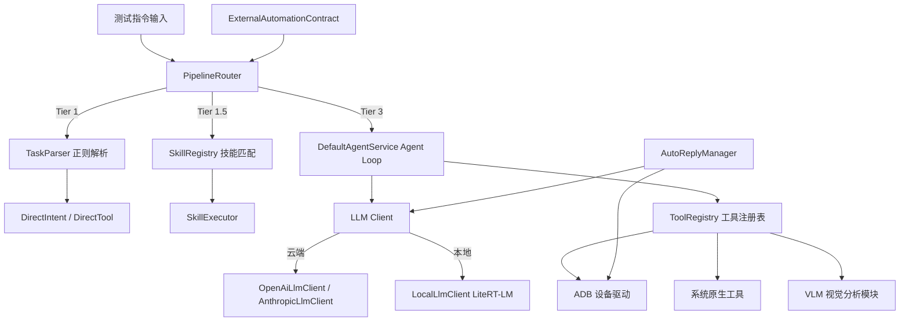

# BQAAgent
BQAAgent 是运行在 Android 设备上、**面向 HSBC 移动端应用打造的 AI 智能自动化测试执行引擎**。依托大语言模型（LLM）驱动，能够理解自然语言测试指令，自主操控手机完成 HSBC App 各类业务流程测试；支持消息自动监控、多步骤业务自动化、视觉兜底识别，同时兼容云端模型与本地端侧模型双模式运行，为移动端金融应用提供一体化智能测试解决方案。

## 📋 目录
- [✨ 项目特性](#-项目特性)
  - [基础版功能](#基础版功能)
- [🚀 版本更新说明](#-版本更新说明)
  - [v0.0.2 新增功能](#v002-新增功能)
  - [v0.0.1 功能](#v001-功能)
- [🏗️ 技术架构](#️-技术架构)
  - [任务执行流程](#任务执行流程)
- [🛠️ 支持工具集](#️-支持工具集)
- [📦 技术栈](#-技术栈)
- [🔨 构建说明](#-构建说明)
- [📁 项目结构](#-项目结构)
- [📄 许可证](#-许可证)

---

## ✨ 项目特性
### 基础版功能
#### 🧠 三层任务路由管线（3-Tier Pipeline）
采用三层递进式任务调度架构，在测试执行效率与复杂业务处理能力之间取得平衡：

| 层级 | 实现方式 | LLM调用次数 | 延迟 | 适用场景 |
|------|----------|-------------|------|----------|
| Tier 1 | 正则确定性解析（TaskParser） | 0 次 | < 1 秒 | 启动应用、截图、返回、打开URL、跳转系统设置、基础设备操作 |
| Tier 1.5 | 预定义技能触发匹配（SkillRegistry） | 0 次 | < 1 秒 | 页面弹窗关闭、权限同意、表单提交等高频固定测试流程 |
| Tier 3 | 完整 Agent Loop 智能循环 | 3~30 次 | 10~60 秒 | 复杂业务流程、多步骤复合测试场景（包含「然后/之后/并且」等连接词） |

> 复合业务测试任务会自动跳过 Tier1 / Tier1.5，直接进入 Agent Loop 处理。

#### 🤖 Agent Loop（感知-思考-行动循环）
核心测试执行引擎 `DefaultAgentService`，遵循 **Observe → Think → Act** 闭环：
1. **Observe**：通过ADB获取当前屏幕UI树信息
2. **Think**：LLM分析界面状态，判断测试进度、规划下一步测试操作
3. **Act**：调用工具执行操作（点击、滑动、输入等），自动附带最新屏幕快照

内置执行策略：先观察后行动、工具调用合并、弹窗优先处理、智能等待页面加载、滚动搜索优化、任务状态追踪、卡死自动检测与恢复。

#### 🛠️ 丰富的手机操控工具集
内置30+原生工具，覆盖移动端自动化测试全场景，详见下方【支持工具集】章节。

#### 💬 消息监控与自动回复
`AutoReplyManager` 实现后台消息监听与智能回复：
- 支持平台：WhatsApp、Telegram、Google Messages(SMS)、LINE、WeChat
- 通过 `NotificationListenerService` 捕获通知消息
- 联系人模糊匹配，支持Unicode归一化、数字别名识别
- LLM生成自然语言回复，云端/本地模型均可调用
- 内置5秒消息去重、自身消息过滤、通知摘要跳过防抖策略
- 前台服务 + 保活任务，保障后台持续监控

#### 📱 本地端侧 LLM 推理
支持完全离线运行大模型，适用于网络隔离的测试环境：
- 推理引擎：Google LiteRT-LM（AI Edge）
- 调度策略：GPU优先，CPU自动降级，配套运行时健康监控
- 模型管理器：支持导入、管理 `.litertlm` 模型文件
- 运行时共享：测试Agent任务、消息自动回复共用一套推理引擎
- 配置持久化：MMKV存储模型参数

#### ☁️ 多云端 LLM 提供商
兼容主流云端大模型，支持自定义API端点：
- DeepSeek（V4 Pro / V4 Flash）
- OpenAI 兼容API（自定义BaseURL，适配GPT系列）
- Anthropic Claude 系列
- 完全自定义模型配置，接入任意OpenAI兼容接口

#### 🎯 预定义技能系统（Skill System）
9项确定性技能，减少不必要LLM轮次调用，提升常规测试流程执行速度：
1. `search_in_app`：应用内搜索并提交
2. `submit_form`：查找并点击提交按钮
3. `dismiss_popup`：关闭弹窗、对话框
4. `scroll_and_read`：滚动页面并提取文本
5. `copy_screen_text`：提取屏幕可见文字
6. `accept_permission`：同意权限/协议弹窗
7. `swipe_gesture`：基础滑动操作
8. `go_back`：返回上一页
9. `wait_for_content`：等待页面加载（最长15秒）

#### 💾 会话管理与测试任务历史
- 多轮测试指令持久化，三层存储：内存缓存 → Markdown文件 → SQLite数据库
- 侧边栏会话列表：新建、切换、删除测试任务会话
- 长测试流程自动上下文压缩，控制Token消耗

#### 🔐 权限与无障碍协调
`AppCapabilityCoordinator` 统一管控自动化所需权限：
- 无障碍服务：UI自动化测试操作
- 通知访问：消息监听自动回复
- 悬浮窗权限：全局任务状态浮窗
  权限状态分级：未配置 / 连接中 / 就绪；缺失权限自动引导跳转设置页面。

#### 🪟 悬浮窗与任务状态
- 全局悬浮按钮展示实时测试任务运行状态
- 顶部任务栏管理多个并发测试任务，支持单独停止/全部终止
- 任务结束自动返回BQAAgent主界面

#### 📡 外部自动化接口
`ExternalAutomationContract` 对外提供自动化调用通道，方便集成CI/测试调度平台：
- Tasker、MacroDroid等工具通过广播发起测试任务
- Action：`io.agents.bqaagent.RUN_TASK` / `io.agents.bqaagent.RUN_CHAT`
- 参数支持明文、Base64编码；支持执行结果回调
- 设置项手动开启外部调用授权

#### 🔧 局域网配置服务
嵌入式HTTP服务（NanoHTTPD），同一局域网电脑浏览器远程配置API Key、模型参数，方便测试机远程调试。

#### 🔒 Fallback 组件兜底机制
基于JSON配置的UI元素兜底定位方案，适配金融应用多变UI场景：
- 加载应用专属/通用组件定位规则
- 文本模糊匹配，限定前台应用内搜索
- 坐标自动缩放，适配不同分辨率、字体大小
- 系统弹窗出现时自动启用兜底策略

#### 💰 Token 预算与成本监控
- 单测试任务可配置Token上限、费用上限
- 80%阈值警告，100%阈值强制终止任务
- 实时统计每轮推理Token消耗，内置主流模型计价信息

#### 🔄 死循环检测（StuckDetector）
5类异常信号识别Agent测试卡死：
1. SameAction：连续3次执行相同操作
2. ScreenUnchanged：连续3步屏幕无变化
3. ZeroDiff：屏幕文本无差异
4. HighRepetition：短窗口内重复操作
5. RepeatedError：相同错误连续触发

三级恢复策略：提示注入 → 策略调整建议 → 任务自动终止

#### 📚 知识库系统（Knowledge Base）
持久化知识库，提供工具：`kb_write` / `kb_read` / `kb_search` / `kb_append` / `kb_add_todo`
Agent在测试执行中可随时读写、检索测试数据、业务规则信息。

#### 📺 多设备类型支持
自动区分 Mobile（手机）与 TV（电视/机顶盒），加载对应工具集：
- 手机：触摸点击、滑动、消息发送、视觉分析，适配移动端App测试
- TV：方向键、音量、电源、菜单等遥控指令

#### 🔐 DirectDeviceDataGuard
防护LLM拒绝读取设备信息问题；当测试指令需要获取剪贴板、通知、电量等数据时，强制模型优先调用工具获取真实数据再进行应答。

#### 🛡️ 安全约束（金融场景专用）
系统提示词内置金融场景安全策略：
- 银行卡、密码、支付敏感信息需外部明确传入
- 支付、转账等高风险操作增加执行校验机制
- 禁止卸载应用、清除数据、恢复出厂等破坏性操作
- 遇到登录墙、付费墙自动暂停并输出测试告警

其他基础能力
- 开机自启动，适合测试机7×24运行
- 电池优化豁免申请，防止后台测试进程被杀
- 明暗双主题
- 新手引导流程
- 多语言：中文 / 英文 

---

## 🚀 版本更新说明
### v0.0.2 新增功能
#### 🎬 Skill 录制 / 保存 / 回放
基于真实任务执行轨迹的可复用技能系统，把「一次成功的自动化流程」沉淀为可反复回放的模板：
- **录制（SkillRecorder）**：Agent Loop 执行过程中自动记录每个可回放工具步骤（点击、输入、滑动、打开应用、发送消息等），同步快照节点定位信息（nodeLocator）、目标文本、锚点文本、期望包名 / Activity 与步骤意图
- **保存（SkillAnalyzer / SkillTemplateBuilder / SkillStore）**：任务成功后弹窗提示保存，按设备环境（语言、地区、分辨率、字体缩放、应用版本）生成执行模板并持久化
- **匹配（SkillMatcher 三道闸门 + 环境预过滤）**：新任务到来时先做环境筛选，再经 Level 0 原文精确匹配
- **回放（SkillReplayer + ReplayVerifier）**：命中后先弹出确认框展示参数替换预览与步骤时间线，用户确认后按锚定与值追踪规则替换参数，逐步执行并以「包名 / Activity / 锚点文本」验证每一步就绪，失败自动降级回 Agent Loop
- **治理（SkillGovernor）**：统计模板成功率，连续失败自动标记不可用，保障回放稳定性

#### 📹 任务过程录屏
任务级屏幕录制，完整留存自动化测试执行过程，便于回溯与问题定位：
- **分段录制（AdbScreenRecorder）**：基于 ADB screenrecord，约 2 分钟安全轮转，重叠旋转自动裁剪重复帧，独立 KADB 通道不干扰自动化操作
- **非阻塞协调（TaskRecordingCoordinator）**：arm / start / stop 全部异步，录制失败自动降级为「无录制」，绝不影响任务执行；默认关闭，开启后才接触设备
- **步骤标记（addMarker）**：录制过程中打点关键步骤，回放时可跳转定位
- **无缝播放（RecordingPlaylist + Media3 ExoPlayer）**：多段视频合并为单一连续时间轴，单进度条跨段拖动无卡顿
- **录制自检（RecordingSelfTest）**：一键检测设备 ADB 配置、shell 通道、screenrecord 二进制、分辨率、存储空间与后台启动能力，自动适配录制参数
- **存储管理（TaskRecordingStore）**：录制清单 manifest.json 持久化，达到存储上限自动清理

#### ✅ 任务结果状态四分类
统一、可信的任务终态模型，明确区分「判定权归属」：
- **SUCCESS / FAILED**：由 LLM 通过 `finish(status=...)` 判定；SUCCESS 额外经过轻量系统证据校验（无成功设备操作的非闲聊任务会被降级为 FAILED / UNVERIFIED）
- **STOPPED**：由系统代码判定（Token / 迭代上限、死循环、系统弹窗、屏幕不可用、敏感策略、图像分析终止等）
- **CANCELLED**：由用户主动取消
- 后端携带 `TaskReasonCode` 细分原因码用于诊断，前端仅展示四类终态

#### 🔍 屏幕数据解析优化
提升 UI 树采集质量与解析效率，为 Agent 决策提供更精准的屏幕信息：
- **UiAutomator2 `--compressed` 压缩抓取**：无临时文件 IO，速度更快、XML 体积更小，低版本自动降级 v1 方案
- **多渲染模式**：detail（逐节点最全，云端默认）/ compact（行分组省 token，本地模型强制）/ text（纯文本行）/ full（原始树调试）
- **屏幕快照缓存（ScreenTreeCache）**：2 秒内命中缓存并校验前台包名 / Activity，避免重复 dump
- **节点 ID 映射（nodeIdMap）**：每个元素行携带独立 node id 与坐标，支持 `tap_node` 精准点击，行内多元素各自寻址
- **屏幕稳定等待（ScreenSettleWaiter）**：操作后两阶段变化检测，等待页面真正稳定再采集，避免抓到过渡态
- **结构化容器过滤与标签富化**：压缩无效节点，提升有效信息密度

### v0.0.1 功能
#### 👁️ 视觉大模型分析（VisionModel / VLM）
当ADB UI树失效、目标元素无法通过控件定位时，启用VLM作为兜底识别方案，应对金融App特殊渲染页面：
- `VisionAnalyzer`：截图+测试意图发送至视觉模型获取操作方案
- `AnalyzeScreenVisualTool`：自动截图、安全页面检测、图像预处理、VLM解析、坐标转换
- VLM输出标准化JSON，包含界面总结、动作类型、像素坐标、执行理由
- VLM配置独立于LLM，可自由搭配GPT-4o、Gemini、Qwen-VL等视觉模型

#### 📷 图片上传兜底（AnalyzeUserImageTool）
应对 `FLAG_SECURE` 安全界面拦截截图（银行App、密码输入页面）：
- 自动提示用户手动上传截图
- 多层安全校验：文件大小、分辨率、路径沙箱隔离
- 自动校正透视畸变、反光、边框遮挡
- 校验图片相关性，无关图片直接终止任务；分析完成自动清理临时文件

#### 🎙️ 端侧离线语音输入
基于sherpa-onnx离线语音识别：
- Zipformer2 Transducer int8量化模型，CPU推理
- 16kHz PCM流式识别，内置端点检测
- 支持实时中间结果、最终识别文本回调
- 长按录音，松开自动识别输入测试指令
- 支持 arm64-v8a / armeabi-v7a / x86 / x86_64

#### 🔒 敏感模式（Sensitive Mode）
面向HSBC等银行应用设计的运行时防护策略：
- 触发条件：开启敏感模式 + 当前前台App匹配敏感应用名单
- 工具限制：禁用截图、文件发送等存在信息泄露风险的能力
- PIN/密码需外部传入，遇到凭证输入界面无参数时立即停止任务
- PIN使用专用安全键盘工具；PIN连续输入两次失败则自动终止流程
- 转账专用工具，默认在审核页面暂停，需要策略授权才可执行确认操作
- 识别验证错误、页面锁定时立即终止任务，输出测试日志

---

## 🏗️ 技术架构


### 任务执行流程
```
测试指令 → PipelineRouter.route()
├── Tier 1: TaskParser.parse() → DirectIntent / DirectTool（0 LLM，< 1秒）
├── Tier 1.5: SkillRegistry.findByTrigger() → SkillExecutor（0 LLM，< 1秒）
└── Tier 3: DefaultAgentService（Agent Loop，3~30次LLM调用）
    ├── 构建系统提示词 + SensitivePolicy + DirectDeviceDataGuard
    ├── LLM调用 → 工具执行 → 附带屏幕快照 → 进入下一轮循环
    ├── StuckDetector 死循环监控
    ├── TaskBudget Token/费用限额管控
    └── finish(summary) 测试任务结束，输出执行结果
```

---

## 🛠️ 支持工具集
| 分类 | 工具名称 | 说明 |
|------|----------|------|
| **屏幕感知** | get_screen_info | 获取ADB UI树（detail/compact/text/full 模式） |
| | find_node_info | 查询控件节点详情 |
| | take_screenshot | ADB截图 |
| | analyze_screen_visual | VLM自动视觉分析（新版） |
| | analyze_user_image | 用户上传图片VLM解析（新版） |
| **触摸操作** | tap | 坐标点击 |
| | tap_node | 根据控件ID点击 |
| | tap_visible_text | 根据文本点击控件 |
| | long_press | 长按 |
| | swipe | 滑动 |
| | scroll_to_find | 滚动页面查找目标文本 |
| | find_and_tap | 查找并点击目标元素 |
| **输入操作** | input_text | 普通文本输入 |
| | input_amount | 金额专用输入（敏感模式） |
| | secure_keypad_input | 安全键盘输入PIN（敏感模式） |
| | system_key | 系统按键：返回/Home/回车 |
| | clipboard | 剪贴板读写 |
| **App管理** | open_app | 打开应用（支持包名/应用名称） |
| | open_url | 跳转链接 |
| | get_installed_apps | 获取本机已安装应用列表 |
| **设备信息** | get_device_info | 查询电量、WiFi、蓝牙、存储等信息 |
| | get_notifications | 获取当前通知列表 |
| **通讯能力** | send_message | 跨平台消息发送 |
| | make_call | 拨打电话 |
| | auto_reply | 开启/关闭消息自动监控 |
| | send_file | 文件发送 |
| **银行专用** | bank_own_account_transfer | 账户转账操作（敏感模式） |
| **高级控制** | repeat_actions | 循环执行动作序列 |
| | wait | 延时等待 |
| **知识库** | kb_write / kb_read / kb_search / kb_append / kb_add_todo | 持久化知识库操作 |
| **任务控制** | finish | 结束任务并输出总结 |
| **TV遥控** | dpad_up/down/left/right/center | 方向键 |
| | volume_up/down / press_menu / press_power | 音量、菜单、电源键 |

---

## 📦 技术栈
| 模块 | 技术选型 |
|------|----------|
| 开发语言 | Kotlin + Java |
| 最低SDK | Android 9 (API 28) |
| 目标SDK | Android 16 (API 36) |
| UI框架 | Jetpack Compose + Material 3 |
| LLM封装 | LangChain4j（OpenAI/Anthropic适配器） |
| 端侧大模型 | Google LiteRT-LM（AI Edge） |
| 离线语音识别 | sherpa-onnx（Zipformer2 Transducer int8） |
| 网络 | OkHttp + 日志拦截器 |
| 持久化存储 | MMKV + SQLite + Markdown |
| ADB自动化 | kadb（Kotlin ADB客户端） |
| 屏幕录制 | ADB screenrecord（分段轮转 + 独立 KADB 通道） |
| 录屏播放 | Media3 ExoPlayer（多段无缝合并时间轴） |
| 悬浮窗 | EasyFloat |
| 图片加载 | Glide |
| 局域网Web服务 | NanoHTTPD |
| 构建系统 | Gradle (Kotlin DSL) + Version Catalog |
| 代码混淆 | R8 / ProGuard（Release包） |

---

## 🔨 构建说明
### 环境要求
- JDK 17+
- Android SDK compileSdk 36
- Gradle 8.x（由Gradle Wrapper自动管理）

### 编译命令
```bash
# Debug 调试包
./gradlew assembleDebug

# Release正式包（需配置签名信息）
./gradlew assembleRelease
```

### 签名配置
Release签名信息读取自 `local.properties` 或环境变量：
```properties
KEYSTORE_FILE=path/to/keystore.jks
KEYSTORE_PASSWORD=xxx
KEY_ALIAS=xxx
KEY_PASSWORD=xxx
```

### 版本配置
版本号通过 `local.properties` / 环境变量注入：
```properties
BQAAGENT_VERSION_CODE=2
BQAAGENT_VERSION_NAME=0.0.2
```

### 输出产物
```
BQAAgent_v{versionName}_{yyyyMMdd_HHmmss}.apk
```

---

## 📁 项目结构
```
app/src/main/
├── java/io/agents/bqaagent/
│   ├── adb/                  # ADB驱动与设备自动化
│   ├── agent/                # Agent核心测试引擎
│   │   ├── llm/              # LLM客户端（云端/本地）
│   │   ├── skill/            # 技能系统：注册、执行、录制、保存、匹配、回放
│   │   ├── knowledge/        # 知识库管理
│   │   └── langchain/        # LangChain4j工具桥接
│   ├── automation/           # 外部自动化广播接口
│   ├── base/                 # 基础通用父类
│   ├── channel/              # 通道配置管理
│   ├── fallback/             # UI兜底定位系统
│   ├── floating/             # 悬浮窗管理
│   ├── recording/            # 任务过程录屏：录制、分段、播放、自检、存储
│   ├── server/               # 局域网HTTP配置服务
│   ├── service/              # 后台服务：通知监听、自动回复、保活
│   ├── tool/                 # 工具注册表与实现
│   │   └── impl/
│   │       ├── mobile/       # 手机专属工具
│   │       └── tv/           # TV机顶盒遥控工具
│   ├── ui/                   # 用户界面
│   │   ├── chat/             # Compose测试指令会话页面
│   │   ├── settings/         # LLM/VLM/权限/主题设置
│   │   ├── guide/            # 新手引导
│   │   ├── splash/           # 启动页
│   │   └── web/              # Web视图
│   ├── utils/                # 通用工具类
│   ├── widget/               # 自定义UI组件
│   ├── AppCapabilityCoordinator.kt
│   ├── AppViewModel.kt
│   ├── ClawApplication.kt    # Application入口
│   ├── TaskEvent.kt
│   ├── TaskOrchestrator.kt   # 测试任务编排器
│   └── TaskSessionStore.kt   # 任务会话状态
├── assets/
│   ├── fallback_profiles/    # UI兜底JSON配置
│   ├── sherpa_models/        # 离线语音识别模型
│   └── web/                  # 网页静态资源
├── jniLibs/                  # sherpa-onnx 原生so库
└── res/                      # Android资源文件
```

## 📄 许可证
```
Copyright 2026 BQAAgent (agents.io). All rights reserved.

Licensed under the Apache License, Version 2.0 (the "License");
you may not use this file except in compliance with the License.
You may obtain a copy of the License at

    http://www.apache.org/licenses/LICENSE-2.0

BQAAgent — AI Intelligent Test Execution Engine built for HSBC Mobile Application, developed by agents.io.
```
